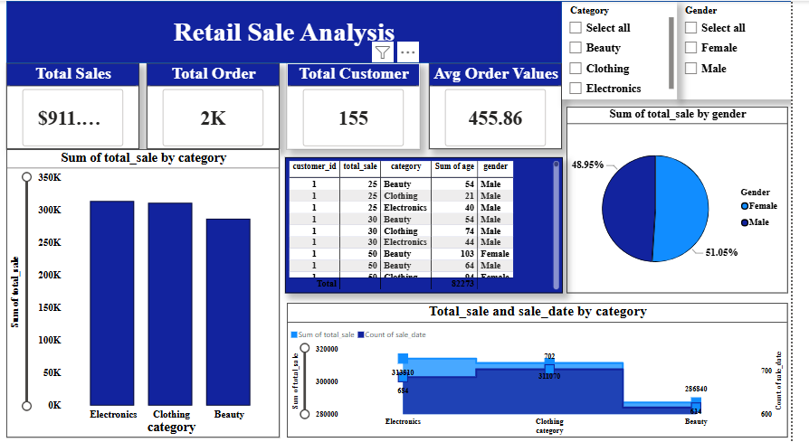

<h1 align="center">Retail Sales Analysis – SQL & Power BI Business Intelligence Project</h1>

<h2> Power BI Dashboard</h2>

The interactive Power BI dashboard summarizes business performance through executive KPIs, sales, total customer , product performance, and gender.

<h2>Project Overview</h2>

Retail companies generate thousands of daily transactions, but raw sales data alone does not provide actionable business value.
This project was developed to simulate a real-world Data Analyst workflow: transforming raw transactional data into meaningful business insights through SQL analysis and interactive Power BI visualization.

The goal was not only to calculate sales numbers, but to understand:

<ul>
<li>Which product categories drive revenue?</li>
<li>Who are the highest-value customers?</li>
<li>How do sales change over time?</li>
<li>When do customers purchase the most?</li>
<li>What patterns can support better business decisions?</li>
</ul>

<h2>Project Objective</h2>

The project follows a complete analytics pipeline from raw data to executive insights:

<ol>
<li>Design and create a relational retail database</li>
<li>Perform data quality checks and cleaning using SQL</li>
<li>Explore customer and sales behavior through Exploratory Data Analysis (EDA)</li>
<li>Develop business KPIs and analytical queries</li>
<li>Apply advanced SQL techniques for deeper insights</li>
<li>Build an interactive Power BI dashboard for decision support</li>
</ol>

<h2>Tools & Technologies</h2>

<table>
<tr>
<th>Technology</th>
<th>Purpose</th>
</tr>

<tr>
<td>SQL (MySQL)</td>
<td>Database creation, cleaning, analysis, KPI development</td>
</tr>

<tr>
<td>MySQL Workbench</td>
<td>Query development and database management</td>
</tr>

<tr>
<td>Power BI</td>
<td>Interactive dashboard development and business storytelling</td>
</tr>

<tr>
<td>Excel / CSV</td>
<td>Initial dataset exploration</td>
</tr>

</table>

<h2>Dataset Description</h2>

The dataset contains retail transaction-level information where each row represents a customer purchase.

<table>

<tr>
<th>Column</th>
<th>Description</th>
</tr>

<tr><td>transaction_id</td><td>Unique transaction identifier</td></tr>
<tr><td>sale_date</td><td>Date of purchase</td></tr>
<tr><td>sale_time</td><td>Time of purchase</td></tr>
<tr><td>customer_id</td><td>Customer identifier</td></tr>
<tr><td>gender</td><td>Customer demographic information</td></tr>
<tr><td>age</td><td>Customer age</td></tr>
<tr><td>category</td><td>Product category</td></tr>
<tr><td>quantity</td><td>Number of purchased items</td></tr>
<tr><td>price_per_unit</td><td>Product unit price</td></tr>
<tr><td>cogs</td><td>Cost of goods sold</td></tr>
<tr><td>total_sale</td><td>Total transaction revenue</td></tr>

</table>

<h2>Analytics Workflow</h2>

<h3>1. Database Development</h3>

The project started by designing a structured SQL database to store retail transactions.
A relational table was created with appropriate data types and transaction-level attributes.

<pre>
CREATE TABLE retail_sales
(
transaction_id INT PRIMARY KEY,
sale_date DATE,
sale_time TIME,
customer_id INT,
gender VARCHAR(15),
age INT,
category VARCHAR(20),
quantity INT,
price_per_unit FLOAT,
cogs FLOAT,
total_sale FLOAT
);
</pre>

<h3>2. Data Cleaning & Quality Improvement</h3>

Before performing analysis, SQL was used to validate and improve data quality.

Cleaning tasks included:

<ul>
<li>Checking missing values in critical business columns</li>
<li>Removing incomplete transactions</li>
<li>Validating transaction consistency</li>
<li>Standardizing categorical fields</li>
<li>Checking duplicate records</li>
</ul>

SQL techniques applied:

<ul>
<li>WHERE conditions</li>
<li>IS NULL validation</li>
<li>DELETE statements</li>
<li>TRIM and text standardization</li>
<li>Data quality checks</li>
</ul>

<h3>3. Exploratory Data Analysis (EDA)</h3>

After cleaning the dataset, SQL was used to understand overall business performance and customer behavior.

Key analysis areas:

<ul>

<li>Total number of transactions</li>

<li>Total revenue generated</li>

<li>Unique customer count</li>

<li>Sales distribution across categories</li>

<li>Customer purchasing patterns</li>

<li>Monthly sales performance</li>

</ul>

Example:

<pre>

SELECT 
category,
SUM(total_sale) AS total_sales,
COUNT(*) AS total_orders
FROM retail_sales
GROUP BY category;

</pre>

<h2>4.Key SQL Business Queries Developed</h2>

During the analysis phase, SQL queries were designed to answer practical business questions and transform transactional data into measurable insights.
The following examples demonstrate how SQL was applied for KPI calculation, customer analysis, and advanced analytical reporting.

<h3>1. Sales Performance by Product Category</h3>

Business Question:
Which product categories generate the highest revenue and transaction volume?

<pre>
SELECT 
    category,
    SUM(total_sale) AS total_revenue,
    COUNT(transaction_id) AS total_orders
FROM retail_sales
GROUP BY category
ORDER BY total_revenue DESC;
</pre>

<strong>Business Value:</strong>
Identifies top-performing categories and supports product strategy, inventory planning, and revenue optimization.

<h3>2. Customer Value Analysis - Top Spending Customers</h3>

Business Question:
Who are the highest-value customers contributing the most revenue?

<pre>
SELECT 
    customer_id,
    SUM(total_sale) AS total_customer_spending,
    COUNT(transaction_id) AS number_of_transactions
FROM retail_sales
GROUP BY customer_id
ORDER BY total_customer_spending DESC
LIMIT 5;
</pre>

<strong>Business Value:</strong>
Helps identify valuable customers and supports customer segmentation, retention strategies, and targeted marketing campaigns.

<h3>3. Monthly Sales Trend Analysis Using Window Functions</h3>

Business Question:
Which month generates the highest average sales performance in each year?

<pre>
SELECT 
    year,
    month,
    avg_sale
FROM
(
    SELECT 
        EXTRACT(YEAR FROM sale_date) AS year,
        EXTRACT(MONTH FROM sale_date) AS month,
        AVG(total_sale) AS avg_sale,

        RANK() OVER(
            PARTITION BY EXTRACT(YEAR FROM sale_date)
            ORDER BY AVG(total_sale) DESC
        ) AS sales_rank

    FROM retail_sales

    GROUP BY 
        EXTRACT(YEAR FROM sale_date),
        EXTRACT(MONTH FROM sale_date)

) AS monthly_sales

WHERE sales_rank = 1;
</pre>

<strong>Business Value:</strong>
Reveals seasonal sales patterns and helps businesses improve demand forecasting, promotional planning, and resource allocation.

<h3>SQL Skills Demonstrated Through These Queries</h3>

<ul>

<li>
Aggregation and KPI calculation using 
<strong>SUM(), COUNT(), AVG()</strong>
</li>

<li>
Customer-level revenue analysis using 
<strong>GROUP BY</strong>
</li>

<li>
Time-series analysis using 
<strong>EXTRACT()</strong> date functions
</li>

<li>
Advanced analytical ranking using 
<strong>RANK() Window Function</strong>
</li>

<li>
Business-focused query development for decision support
</li>

</ul>

<h2>Business Analysis & SQL Insights</h2>

<h3>Sales Performance Analysis</h3>

SQL queries were developed to measure revenue contribution and identify important sales patterns.

<ul>

<li>Total sales by product category</li>

<li>Highest-value transactions</li>

<li>Monthly sales performance</li>

<li>Best-performing periods by year</li>

</ul>

<h3>Customer Analytics</h3>

Customer behavior was analyzed to identify valuable customer segments.

<ul>

<li>Top 5 customers based on total spending</li>

<li>Unique customers by product category</li>

<li>Customer age-group classification</li>

<li>Purchasing behavior by demographic groups</li>

</ul>

<h3>Time-Based Analysis</h3>

Sales timing patterns were analyzed to understand customer purchasing habits.

<ul>

<li>Morning, Afternoon, and Evening sales shifts</li>

<li>Monthly sales trends</li>

<li>Peak purchasing periods</li>

</ul>

<h2>Advanced SQL Techniques Applied</h2>

<ul>

<li>
<strong>Aggregation Functions:</strong>
SUM(), COUNT(), AVG() for KPI calculations
</li>

<li>
<strong>CASE Statements:</strong>
Customer segmentation and business classification
</li>

<li>
<strong>Window Functions:</strong>
RANK(), DENSE_RANK(), SUM() OVER() for advanced analytics
</li>

<li>
<strong>CTEs:</strong>
Organizing complex analytical workflows
</li>

<li>
<strong>Date Functions:</strong>
Time-series sales analysis
</li>

</ul>

<h2>Power BI Dashboard</h2>

The cleaned SQL dataset was connected to Power BI to create an interactive business intelligence dashboard.
The dashboard converts analytical results into visual insights for decision-makers.

<h3>Dashboard Components</h3>

<table>

<tr>
<th>Dashboard Area</th>
<th>Purpose</th>
</tr>

<tr>
<td>Executive Overview</td>
<td>Monitor overall sales KPIs and business performance</td>
</tr>

<tr>
<td>Sales Analysis</td>
<td>Analyze revenue trends and category performance</td>
</tr>

<tr>
<td>Customer Analytics</td>
<td>Understand customer behavior and purchasing patterns</td>
</tr>

<tr>
<td>Product Analysis</td>
<td>Identify high-performing categories</td>
</tr>

<tr>
<td>Time Analysis</td>
<td>Discover seasonal and hourly sales patterns</td>
</tr>

</table>

<h2>Business Insights Generated</h2>

<ul>

<li>
Identified top revenue-generating product categories.
</li>

<li>
Discovered customer segments contributing the highest sales.
</li>

<li>
Analyzed seasonal sales patterns to support demand planning.
</li>

<li>
Identified purchasing behavior based on transaction timing.
</li>

<li>
Created KPI-driven reporting structure for business decision-making.
</li>

</ul>

<h2>Skills Demonstrated</h2>

<ul>

<li>SQL Database Development</li>

<li>Data Cleaning and Validation</li>

<li>Exploratory Data Analysis</li>

<li>Business KPI Development</li>

<li>Customer Analytics</li>

<li>Time-Series Analysis</li>

<li>Advanced SQL Window Functions</li>

<li>Power BI Dashboard Development</li>

<li>Data Storytelling</li>

</ul>

<h2>Conclusion</h2>

This project demonstrates a complete Data Analyst workflow: starting from raw transactional data, improving data quality, extracting business insights using SQL, and presenting results through an interactive Power BI dashboard.

The project highlights practical experience in transforming data into actionable insights that support sales strategy, customer understanding, and operational decision-making.

