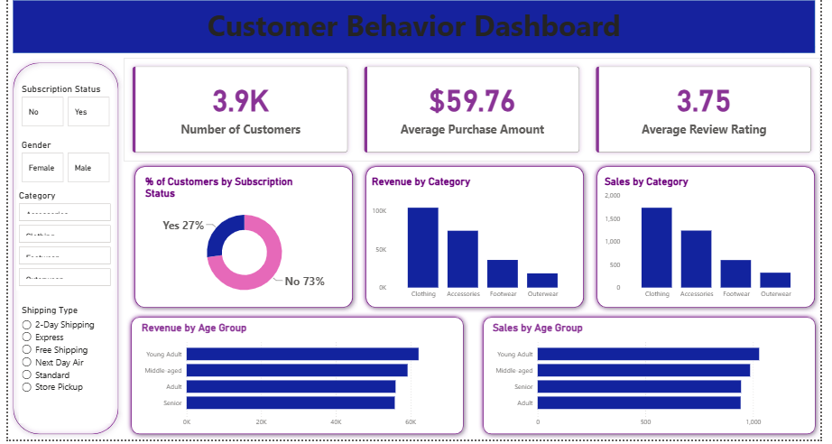

<h1 align="center">Customer Behavior Data Analytics Project</h1>

<h2> Power BI Dashboard</h2>

<h2>Business Problem</h2>

Retail companies continuously experience changes in customer purchasing behavior across different demographics,
product categories, and sales channels. These changes directly influence sales performance, customer satisfaction,
and long-term customer loyalty.

In this project, I simulated the role of a Data Analyst working with a retail organization that needed better
visibility into customer behavior and purchasing patterns.

The company needed answers to key business questions:

<ul>
<li>What factors influence customer purchasing decisions?</li>
<li>Which customer segments contribute the most revenue and repeat purchases?</li>
<li>How do discounts, reviews, seasons, and payment methods affect buying behavior?</li>
<li>How can customer insights improve marketing and product strategies?</li>
</ul>

<h3>Core Business Question</h3>

<strong>
How can consumer shopping data be transformed into actionable insights to improve customer engagement,
optimize marketing strategies, and support better product decisions?
</strong>

<h2>Project Objectives</h2>

This project follows a real-world analytics workflow designed to understand customer behavior and generate
business recommendations.

The main objectives were to:

<ul>
<li>Analyze customer purchasing patterns and sales trends</li>
<li>Identify key drivers affecting customer decisions</li>
<li>Segment customers based on purchasing behavior and value</li>
<li>Evaluate the impact of discounts, reviews, and purchasing channels</li>
<li>Generate actionable insights to improve customer experience and business performance</li>
</ul>

<h2>Key Challenges</h2>

Real-world business datasets often contain multiple challenges that require both technical and analytical solutions.

<ul>
<li>Raw customer data required cleaning and transformation before analysis</li>
<li>Customer behavior was influenced by multiple factors such as seasonality, discounts, and sales channels</li>
<li>Business questions needed to be translated into measurable analytical metrics</li>
<li>Technical analysis needed to be converted into actionable business recommendations</li>
</ul>

<h2>End-to-End Analytics Workflow</h2>

<h3>1. Data Preparation & Modeling Using Python</h3>

The project started with preparing raw customer transaction data for analysis.
Python was used to clean, transform, and explore the dataset before loading it into analytical systems.

Main activities included:

<ul>
<li>Cleaning missing and inconsistent data</li>
<li>Transforming raw data into an analysis-ready format</li>
<li>Performing exploratory data analysis (EDA)</li>
<li>Analyzing customer demographics and purchasing patterns</li>
<li>Engineering analytical features such as customer segments, purchase frequency, and revenue contribution</li>
</ul>

<strong>Skills Applied:</strong>

<ul>
<li>Data cleaning</li>
<li>Feature engineering</li>
<li>Exploratory Data Analysis</li>
<li>Python data analysis</li>
</ul>

<h3>2. Customer Analytics Using SQL</h3>

After preparing the dataset, SQL was used to create a structured analytical environment and answer
business-focused questions.
<li>Designed a structured relational database schema using SQLAlchemy and MySQL</li>
  <li>Created a reliable analytical environment for customer transaction data</li>

A relational database schema was designed using SQLAlchemy to simulate a real-world business transaction system.

SQL analysis focused on:

<ul>
<li>Customer segmentation analysis</li>
<li>Revenue contribution by customer groups</li>
<li>Sales trends across time periods</li>
<li>Product category performance</li>
<li>Online versus offline channel analysis</li>
<li>Discount impact analysis</li>
<li>Payment method preferences</li>
<li>Repeat customers versus one-time buyers</li>
</ul>

<strong>SQL Techniques Applied:</strong>

<ul>
<li>Data aggregation using SUM(), COUNT(), and AVG()</li>
<li>GROUP BY analysis</li>
<li>Filtering and conditional logic</li>
<li>Customer-level analysis</li>
<li>KPI calculation</li>
<li>Business-oriented SQL querying</li>
</ul>

<h3>3. Power BI Business Intelligence Dashboard</h3>

The analyzed dataset was connected to Power BI to create an interactive dashboard designed for business
stakeholders.

The dashboard provides visibility into:

<ul>
<li>Revenue trends and sales performance</li>
<li>Customer segments and purchasing behavior</li>
<li>Online versus offline channel performance</li>
<li>Seasonal demand patterns</li>
<li>Product and category contribution</li>
</ul>

Interactive filtering and visualization features allow users to explore customer behavior and identify
important business patterns.

<h3>4. Insights Generation & Business Recommendations</h3>

The final analysis focused on translating technical results into business recommendations.

Key insights generated included:

<ul>
<li>Identification of high-value customer segments contributing the most revenue</li>
<li>Understanding the effectiveness of discounts on purchasing behavior</li>
<li>Detection of seasonal demand fluctuations</li>
<li>Analysis of preferred payment methods and their relationship with sales</li>
<li>Identification of factors influencing customer engagement</li>
</ul>

These insights supported recommendations to:

<ul>
<li>Improve customer retention strategies</li>
<li>Optimize promotional campaigns</li>
<li>Enhance product positioning</li>
<li>Create personalized marketing strategies</li>
</ul>

<h3>5. Reporting & Business Presentation</h3>

To communicate findings effectively, the project included structured reporting and stakeholder-focused
presentation materials.

The reporting process emphasized:

<ul>
<li>Clear analytical storytelling</li>
<li>Visual communication of insights</li>
<li>Business-focused recommendations</li>
<li>Decision-support reporting</li>
</ul>

<h3>6. Project Deployment & Documentation</h3>

The complete project was organized as a reproducible analytics portfolio project.

The repository structure includes:

<ul>
<li>Python notebooks for data preparation and analysis</li>
<li>SQL scripts for database analysis</li>
<li>Power BI dashboard files</li>
<li>Documentation explaining methodology and insights</li>
</ul>

<h2>Tools & Technologies</h2>

<table>

<tr>
<th>Technology</th>
<th>Purpose</th>
</tr>

<tr>
<td>Python (Pandas, NumPy, Matplotlib, Seaborn)</td>
<td>Data cleaning, transformation, and exploratory analysis</td>
</tr>

<tr>
<td>SQL (MySQL / PostgreSQL / SQL Server)</td>
<td>Database development and business analysis</td>
</tr>

<tr>
<td>SQLAlchemy</td>
<td>Database connection and data modeling</td>
</tr>

<tr>
<td>Power BI</td>
<td>Interactive dashboard development and visualization</td>
</tr>

<tr>
<td>GitHub</td>
<td>Project documentation and version control</td>
</tr>

</table>

<h2>Key Skills Demonstrated</h2>

<h3>Technical Skills</h3>

<ul>
<li>Data Cleaning and Preprocessing</li>
<li>Exploratory Data Analysis (EDA)</li>
<li>SQL Query Development</li>
<li>Relational Database Design</li>
<li>Data Modeling</li>
<li>Dashboard Development</li>
</ul>

<h3>Analytical Skills</h3>

<ul>
<li>Customer Segmentation</li>
<li>Trend Analysis</li>
<li>KPI Development</li>
<li>Customer Behavior Analysis</li>
<li>Business Insight Generation</li>
</ul>

<h3>Business Skills</h3>

<ul>
<li>Translating data into business strategy</li>
<li>Stakeholder-focused reporting</li>
<li>Data storytelling</li>
<li>Decision support analysis</li>
</ul>

<h2>Project Workflow</h2>

<pre>
Raw Customer Data
        ↓
Data Cleaning & Feature Engineering (Python)
        ↓
Exploratory Data Analysis
        ↓
SQL Database Development
        ↓
Customer & Sales Analytics
        ↓
Power BI Dashboard
        ↓
Business Insights & Recommendations
</pre>

<h2>How to Run the Project</h2>

<pre>
git clone [repository-url]
Open the Python notebook
Clean and prepare customer data
Using SQLAlchemy for connect dataset with database (MySQL)
Load data into SQL database
Run SQL queries for business analysis
Connect SQL database to Power BI
Explore the interactive dashboard
</pre>

<h2>Business Impact</h2>

This project demonstrates how raw customer transaction data can be transformed into strategic business insights.
The analysis supports organizations in improving customer understanding, optimizing marketing decisions,
and increasing operational effectiveness.

The final solution helps businesses:

<ul>
<li>Increase revenue through better customer understanding</li>
<li>Improve customer retention strategies</li>
<li>Optimize marketing return on investment</li>
<li>Identify valuable customer segments</li>
<li>Make data-driven business decisions</li>
</ul>

